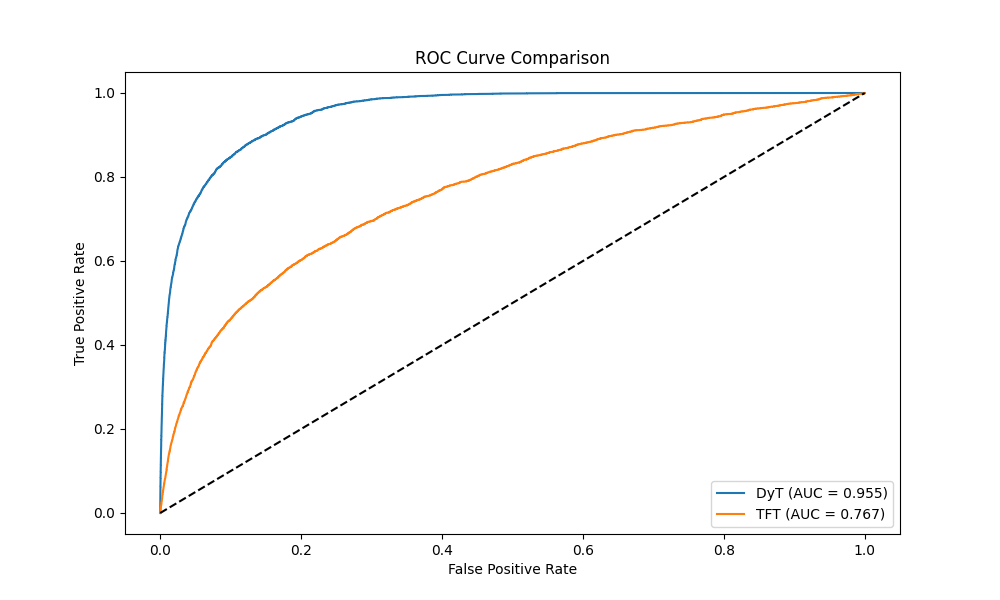
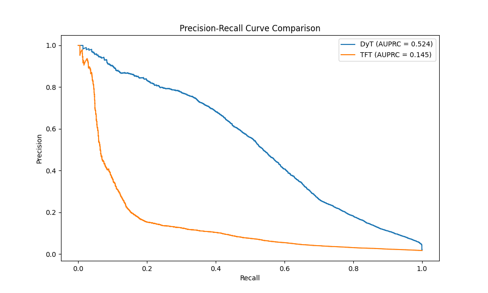

# Early Sepsis Prediction with Dynamic Tanh (DyT) Transformer

This repository contains the implementation of a deep learning framework for the early prediction of Sepsis in ICU patients using the PhysioNet 2019 Challenge dataset. 

We propose a novel **Dynamic Tanh (DyT) Transformer** designed to handle the irregularity and non-stationarity of ICU time-series data. It outperforms standard baselines by dynamically adapting normalization statistics and explicitly modeling time gaps.

## 🚀 Key Features

*   **Dynamic Tanh (DyT) Normalization**: Adapts to sudden physiological shifts (e.g., shock onset) using a learnable, input-dependent activation.
*   **Temporal Attention**: A modified Self-Attention mechanism that accounts for variable time intervals between observations.
*   **Multi-Task Learning**: Simultaneously predicts **Sepsis Risk** (Classification) and forecasts **Future Vitals** (Regression) for the next 3 hours.
*   **Real-time Monitoring Suite**: Includes a unified Streamlit dashboard for retrospective analysis, real-time simulation, and model comparison.

## 📊 Results

The model was evaluated on a held-out test set using hospital-based cross-validation.

| Model | AUROC | AUPRC |
| :--- | :--- | :--- |
| **DyT Transformer (Proposed)** | **0.9024** | **0.1837** |
| TFT Baseline (LayerNorm) | 0.7001 | 0.0571 |

**Analysis**: DyT achieves significantly higher discrimination (AUROC) and precision (AUPRC), validating the importance of dynamic scaling for this task.

### Performance Plots
| ROC Curve | PR Curve |
| :---: | :---: |
|  |  |

## 🛠️ Installation

1.  **Clone the repository**:
    ```bash
    git clone https://github.com/SreeVarshinii/ICU_sepsis_prediction.git
    cd ICU_sepsis_prediction
    ```

2.  **Install dependencies**:
    ```bash
    pip install -r requirements.txt
    ```

## 💻 Usage

### 1. Data Preparation
Download the PhysioNet 2019 data and place it in `data/raw`. Then run:
```bash
# Create unified parquet file
python src/data/preprocessing.py

# Generate train/val/test splits
python src/data/make_splits.py
```

### 2. Training
Train the proposed DyT model and the TFT baseline:
```bash
# Train DyT
python src/train.py --model dyt --epochs 20 --save_dir models/dyt_run

# Train TFT
python src/train.py --model tft --epochs 20 --save_dir models/tft_run
```

### 3. Evaluation
Evaluate models and generate plots:
```bash
python src/evaluate.py --model dyt --checkpoint models/dyt_run/dyt_best.pth --output_dir results
python src/evaluate.py --model tft --checkpoint models/tft_run/tft_best.pth --output_dir results

# Generate Comparison Plots
python src/compare.py --results_dir results
```

### 4. Live Demo & Dashboard
**[🚀 Click Here to Try the Live App](https://icu-sepsisprediction-monitoring.streamlit.app/)**

Launch the unified web interface containing the Patient Dashboard and Real-time Monitor locally:
```bash
streamlit run demos/dashboard/app.py
```

## 📂 Project Structure

```
Sepsis pred/
├── data/                   # Data storage (raw, processed, splits)
├── demos/                  # Visualization & Demo scripts
│   ├── dashboard/          # Streamlit App
│   └── monitor.py          # CLI Monitor Sim
├── models/                 # Saved model checkpoints
├── notebooks/              # Exploratory Data Analysis
├── reports/                # Documentation & Reports
├── results/                # Evaluation plots & CSVs
├── src/                    # Source Code
│   ├── data/               # Data loading & preprocessing
│   ├── models/             # PyTorch Model Architectures (DyT, TFT)
│   ├── train.py            # Training Loop
│   ├── evaluate.py         # Evaluation Script
│   └── compare.py          # Comparison Script
└── tests/                  # Unit Tests
```

## 📜 License
This project is open-source. Please attribute the PhysioNet 2019 Challenge for the dataset.
